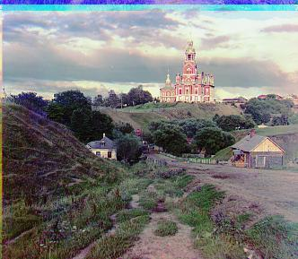
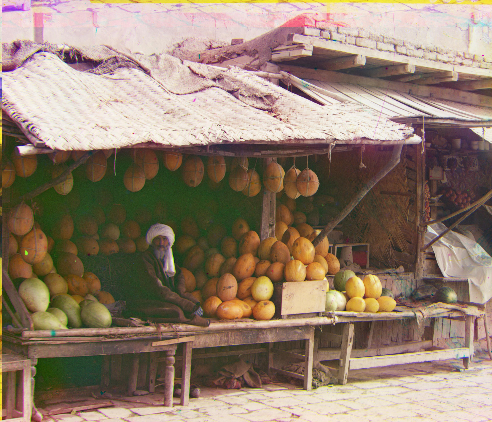
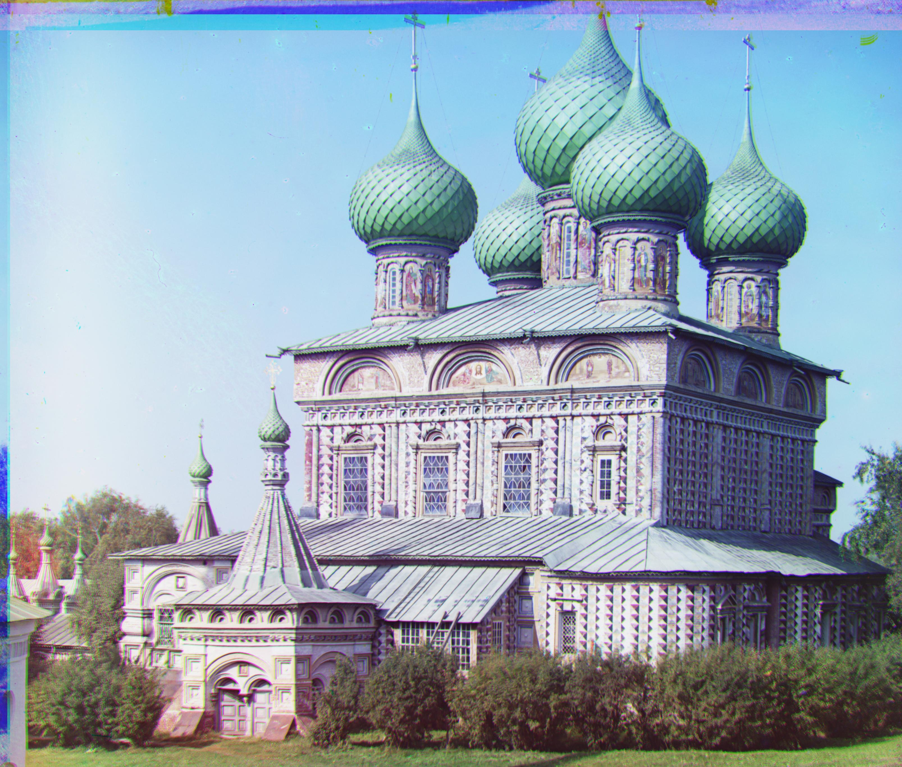
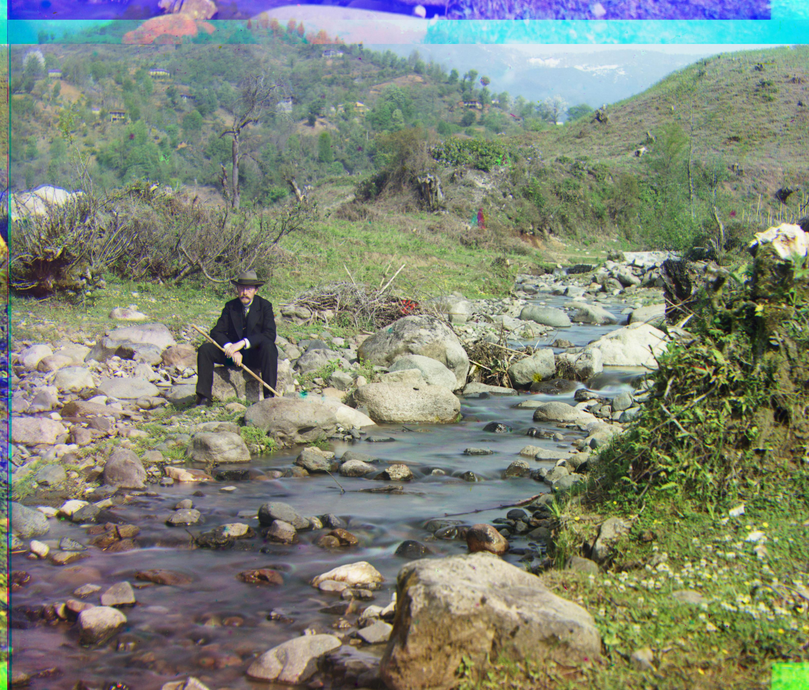
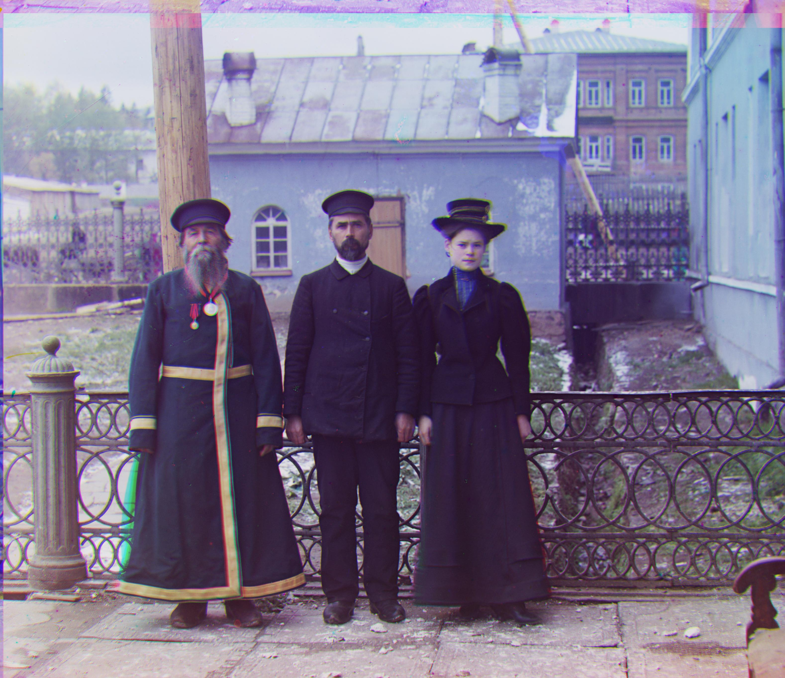
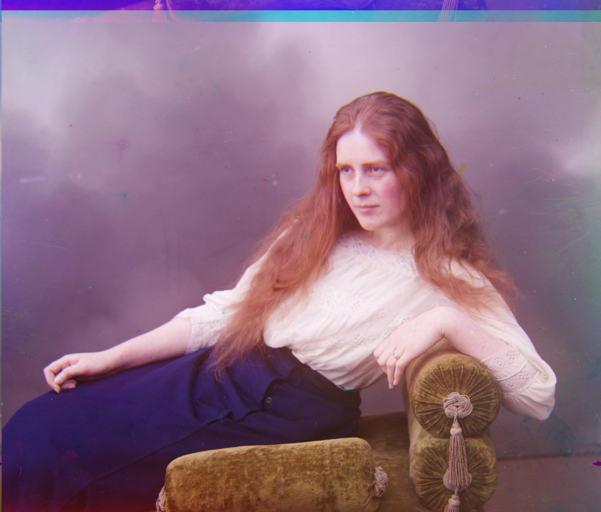

# Project 1 Web Report 

# Background and Details 

Details can be found in this link: https://inst.eecs.berkeley.edu/~cs180/fa24/hw/proj1/

Essentially, from an image with separate RGB channels, we first align the channels and then create the corresponding RGB image.

# Implementation

Using `skimage` and `numpy`, we can easily extract image data and align the channels and create the RGB image. 

## Input 

Images consist of 3 vertically stacked images of same size that are split in 3 channels. 

<!-- table of images -->
| Cathedral | Tobolsk | Monastery | Harvesters | Melons | Onion Church | Self Portrait | Three Generations | Train | Sculpture | Lady | Church | Emir | Icon | 
|-----------|---------|-----------|------------|--------|--------------|--------------|-------------------|-------| ---------- | ---- | ------ | ---- | ---- |
|  |  |  |  |  |  |  |  |  |  |  |  |  |  |

Therefore, we can extract the 3 channels by splitting the image into 3 parts.

## Alignment for small images

The three channels as images are not aligned and therefore we need to align them. We can do this by cropping the borders and then using the `skimage` library to align the images. We also crop the borders so that they do not interfere with the alignment. I crop 15% of the outer borders for convenience.

To align them, we think of displacing a channel to left/right/top/bottom with respect to the other channels. The best alignment either minimizes the L2 norm of the difference between the channels or maximizes the normalized cross-correlation (NCC) between the channels. Note that the window of displacement is important because it affects performance, so we don't want to large of a window, but at the same time we don't want to small of a window otherwise we might miss the best alignment. For small images, a window of 15 pixels is sufficient. 

Once aligned, we can simply stack the images to create the RGB image.

## Output for small images

After trying both L2 norm and NCC, I found that NCC works better. The output image for small images is as follows:

<!-- table -->
| Cathedral | Tobolsk | Monastery |
|-----------|---------|-----------|
|  |  |  |

## Alignment for large images

For large images, we need to use a larger window size for alignment. But it's unreasonable to use a large window size for the entire image because it would be computationally expensive. Therefore, we can use a pyramid approach where we first downsample the image and then align the downsampled image. Once aligned, we can upsample the image and then align the image again. We can repeat this process until we reach the original image size. The algorithm is as follows:
0. read the image
1. downsample the image that is less than 400x400 (since that is the size of small images)
2. align the downsampled image and store the best displacement
3. apply the displacement * 2 to an upscaled version (by 2) of the image and check for alignment in a local area (recommended 15 pixels) around the displacement
4. repeat steps 2 and 3 until we reach the original image size
5. return the aligned image

This is implemented recursively in the `align` function. This way, we reduce the computational cost of aligning large images by having a smaller window size for alignment in total.

This actually takes 24 minutes in total to run on a MacBook Pro 64 Gb RAM, M1 Max Processor for a total of 11 TIFF images. This means an average of 2 minutes per image.

## Output for large images

The output image for large images is as follows:

<!-- table but vertical -->
| Image | Result |
|-------|--------|
| Harvesters |  |
| Melons |  |
| Onion Church |  |
| Self Portrait |  |
| Three Generations |  |
| Train |  |
| Sculpture |  |
| Lady |  |
| Church |  |
| Emir |  |
| Icon |  |

# Conclusion

The results show promise and the algorithm works well for both small and large images. The alignment is accurate and the RGB images are created successfully.