# Project 2 Web Report 

# Background and Details 

Details can be found in this link: https://inst.eecs.berkeley.edu/~cs180/fa24/hw/proj2/

This project has to do with convolutional filters and frequencies of images for the purposes of edge detection, blurring, sharpening/embossing, morphing and multi-resolution blending. We explore the what frequencies are and how they can be used to manipulate images. We also look at how to apply convolutional filters to images and how to blend images together or create an illusion of morphing between two images. This exists in the real world too! For example, Mona Lisa is a blend of a woman looking at the viewer and a woman looking away from the viewer from different frequencies, which gives it a strange effect of her eyes following you. We also see blending effects in movies and animations where two images are blended together to create a smooth transition. We will try to replicate this effect in this project for 2D images.

# Filters 
## Using Finite Difference Operator for Edge Detection (High-Pass Filter)

Filters are used to manipulate images, or to "filter" out certain frequencies. This can be done in many ways, but we will start with the fundamental approach: the finite difference operator. This operator is used to approximate the derivative of an image. The derivative of an image is the rate of change of the image intensity. This can be used to detect edges in an image by getting the highest rate of change in intensity in both the x and y directions. This makes sense because edges are high frequency components of an image because they are the points where the intensity changes rapidly. We can use the finite difference operator to detect these edges, to get a kind of "edge filter" or high-pass filter. 

But how do we apply the finite difference operator to an image? We can use convolution! Convolution is a mathematical operation that takes two functions and produces a third function that represents how the shape of one is modified by the other. In the context of images, we can think of the image as a function of intensity values and the filter as a function of weights. We can slide the filter over the image and multiply the filter weights with the image intensity values and sum them up to get the output image. This is how we can apply the finite difference operator to an image. In practice, we separately convolve r, g, and b channels with the finite difference operator to get the x and y gradients of the image.

To go from the differentials to an edge image, we can take the gradient magnitude of the image. The gradient magnitude is the square root of the sum of the squares of the x and y gradients. This gives us the magnitude of the rate of change of intensity in the image. We can then binarize this image to get a binary image of the edges. 

The finite difference operator is defined as follows:

$D_x = \begin{bmatrix} -1 & 1 \end{bmatrix}, D_y = \begin{bmatrix} -1 \\ 1 \end{bmatrix}$

Then to find the gradient magnitude, we can use the following formula:

$G = \sqrt{(I * D_x)^2 + (I * D_y)^2}$

Where $I$ is the image and $*$ is the convolution operator.

Consider the following image:

By convolving with the finite difference operator, we get the following images:

<!-- table of convolved dx, convolved dy, gradient magnitude, gradient magnitude binarized  vertically! -->
| $D_x$ |  |
| --- | --- | 
| $D_y$ |  |
| Gradient Magnitude | 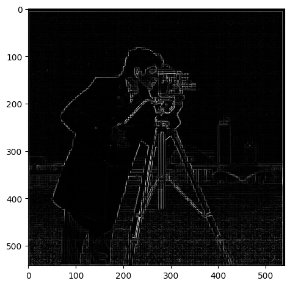 |
| Gradient Magnitude Binarized |  |

Qualitatively, we chose a treshold of 0.05 for the gradient magnitude to binarize the image. This is because the gradient magnitude is a value between 0 and 1, and we want to capture the edges in the image. We can see that the edges are captured in the binarized image.

## Derivative of Gaussian for Blurring (Low-Pass Filter)

The above is great but it's noisy! We can use a Gaussian filter to smooth the image to reduce noise. The Gaussian filter is a low-pass filter that blurs the image. This is because the Gaussian filter is a bell curve that gives more weight to the center and less weight to the edges. This means that the high frequency components of the image are reduced and the low frequency components are preserved when we convolve an image with the Gaussian filter.

A Gaussian filter has two parameters: the standard deviation and the size of the filter. The standard deviation determines how much the filter blurs the image. The larger the standard deviation, the more the image is blurred. The size of the filter determines how much of the image is blurred. The larger the filter, the more the image is blurred. We can use the Gaussian filter to blur the image to reduce noise. I will denote $W$ as the size of the filter and $\sigma$ as the standard deviation. How do we choose these parameters? We can use the following formula to determine the size of the filter:

$W = 6 * \sigma$

This is because 99.7% of the Gaussian distribution is within 3 standard deviations of the mean. Therefore, we can use 6 standard deviations to get a good approximation of the Gaussian distribution. It's a mathematical property of the Gaussian distribution that we can use to determine the size of the filter.

So here, our approach is to blur the image with a Gaussian filter to reduce noise. We can then apply the finite difference operator to the blurred image to detect edges, using threshold 0.5. 

Using the same image, we have: 

<!-- W = 11 , sigma = 11/6 -->
<!-- table of blurred image, convolved dx, convolved dy, gradient magnitude, gradient magnitude binarized  vertically! -->
| Blurred Image |  |
| --- | --- |
| $D_x$ |  |
| $D_y$ |  |
| Gradient Magnitude | 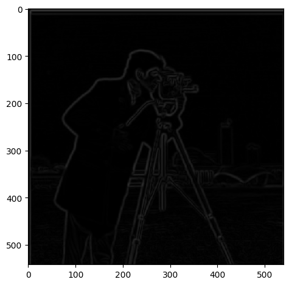 |
| Gradient Magnitude Binarized |  |

**Differences**

<!-- without blur and with blur table -->
| Without Blur | With Blur |
| --- | --- |
|  |  |

The difference is pretty clear. The edges are more smooth, and there is also less noise. All the while there are more edges represented in the image. This is because the Gaussian filter reduces noise and preserves the edges in the image. 

We can actually do the same thing with a single convolution instead of two by creating a derivative of gaussian filters. we can convolve the gaussian with D_x and D_y and display the resulting DoG filters as images. Mathematically: 

$DoG_x = \begin{bmatrix} -1 & 1 \end{bmatrix} * G$, $DoG_y = \begin{bmatrix} -1 \\ 1 \end{bmatrix} * G$

Where $G$ is the Gaussian filter.

Here is the result:

<!-- table of DoG_x, DoG_y -->
*These images are normalized to be between 0 and 1 for visualization purposes.*
| DoG_x |  |
| --- | --- |
| DoG_y |  |

And we get the same final result using only this filter: 

| Gradient Magnitude |  |

They look the same! We can even verify that using the DoG filter is numerically the same as using the two filters separately by convolving the cameraman image with the DoG filters and comparing the results to the gradient magnitude image. This is done in the code, if the reader is interested in seeing the results.

# Frequencies

## Image Sharpening and Embossing

We want to emboss an image. This is a cool effect where the image looks like it's popping out of the screen. How exactly does it work? It is all about getting edges in the image and then adding them to the images! Since edges are high frequency components of the image, we can use the high frequency components of the image to create the embossing effect. 

But how can we get the high frequency components of the image? Instead of using the finite difference operator, we will use the "unsharp mask" filter. This filter is used to sharpen images by enhancing the high frequency components of the image. It does this by subtracting the blurred image from the original image. This leaves only the high frequency components of the image. We can then add this to the original image to get the embossing effect. the technique is called "unsharp masking" because it uses an unsharp (blurred) version of the image as a mask to identify and then enhance the areas that need sharpening. It's a bit of a misnomer because the final result is a sharpened image, not an unsharp one. The math is as follows:

$$f + \alpha(f - f * g) = (1 + \alpha)f - \alpha f * g = f * ((1 + \alpha)I - \alpha g)$$

Where $f$ is the original image, $g$ is the Gaussian filter, and $\alpha$ is a parameter that determines how much the high frequency components are enhanced. Notice how we now rewrite the formula in terms of a single convolution!

After coding up the formula, we get the following results: 

| | Original Image | Sharpened Image | 
| --- | --- | --- |
| Taj Mahal, $W = 11, \alpha = 3$ | 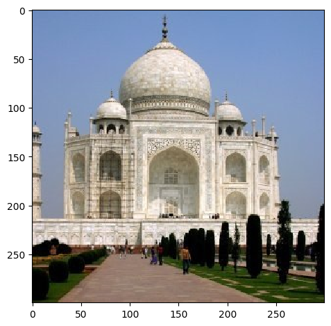 |  |
Blobs, $W = 11, \alpha = 10$ | 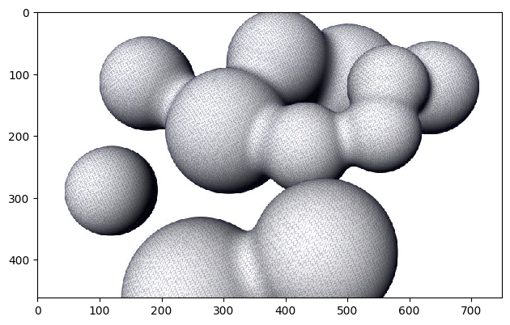 |  |
| Blurry David, $W = 11, \alpha = 10$ | 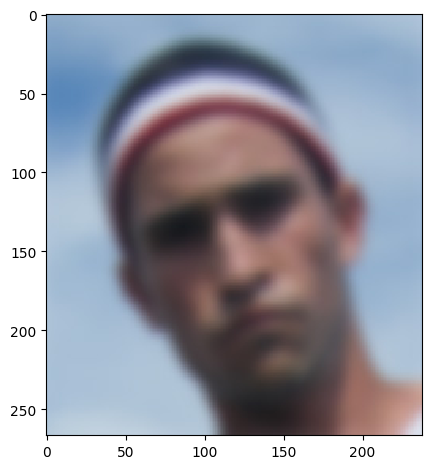 | 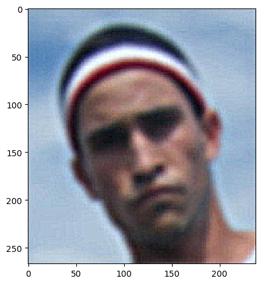 |

We can also evaluate our result by blurring the image and then sharpening after: 
| blurred | sharpened after blurring |
| --- | --- |
|  |  |

Certainly the **difference** is that the low frequency details are gone after blurring and sharpening does not bring them back. However, the edges are more pronounced in the sharpened image even when compared to the original image, given the right parameters of $\alpha$ and $W$.

You can notice very clearly that the edges are more pronounced in the sharpened image. Almost makes it look like it pops out of the screen!

## Hybrid Images

We can also create hybrid images by blending two images together. This is done by blending the low frequency components of one image with the high frequency components of another image. This creates an image that looks like one image up close and another image from far away. This is because the low frequency components of an image are the global features of the image that can be seen from far away, while the high frequency components are the local features of the image that can only be seen up close. 

What are the parameters that we can use to blend the images? We care about the cutoff frequency, which is the frequency at which the low frequency components of one image and the high frequency components of another image are blended. This actually relates to the window size and standard deviation of the Gaussian filter, which I estimated to be around $0.132 / cutoff$ for $\sigma$ and $6 * \sigma$ for the window size. I reached this conclusion starting from mathematical definitions [here](https://en.wikipedia.org/wiki/Gaussian_filter).

**General Approach Summarized**: For our high pass filter, we use simply the opposite of the low pass filter, which is impulse filter - low pass filter. We then apply the low pass filter to the first image and the high pass filter to the second image via convolution. We then add the two images together to get the hybrid image.

### Results

| First Image | Second Image | Hybrid Image |
| --- | --- | --- |
|  | 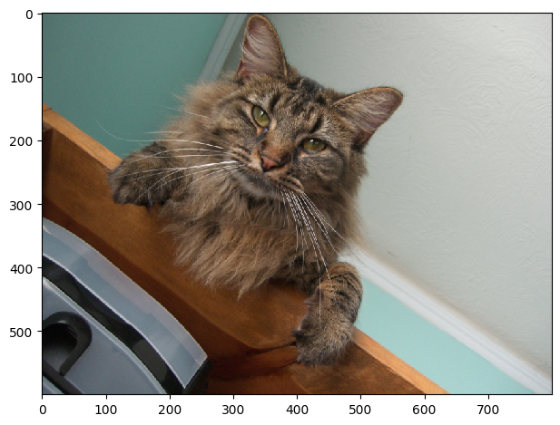 | 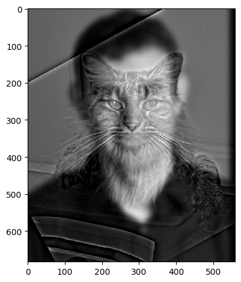 |
*cutoff = 0.02*

we can see from the first reusult that it works well since there is good alignment. We can see some more interesting results of these hybrids: 

| First Image | Second Image | Hybrid Image |
| --- | --- | --- |
|  |  |  |
| 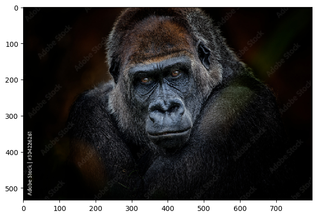 | 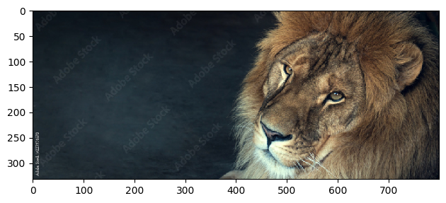 | 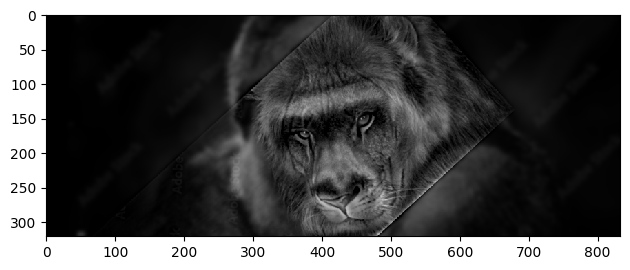 |

The results are quite interesting! Traces of mystique hiding behind Jennifer Lawrence seen in the second while in the second we have a lion-ape! We can see that the hybrid images look like one image up close and another image from far away. This is because the low frequency components of one image and the high frequency components of another image are blended together. This creates an image that looks like one image up close and another image from far away. This is a cool effect that can be used in art and photography to create interesting images. However, alignment is key to getting a good hybrid image. If the images are not aligned properly, the hybrid image will not look good. 

### Fourier Analysis

Let's take a look at the fourier transforms of the iamges. 

<!-- result, input 1, input 2, filtered, hybrid -->
| Result |  |
| --- | --- |
| Image 1 FFT |  |
| Image 2 FFT |  |
| Filtered Image 1 FFT | 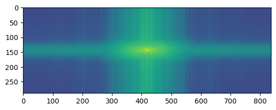 |
| Filtered Image 2 FFT | 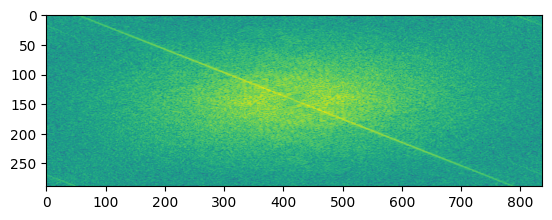 |
| Hybrid Image FFT |  |

What do these images tell us? The FFT of the first image shows the low frequency components of the image. The FFT of the second image shows the high frequency components of the image. The filtered images show the low and high frequency components of the images after filtering. The hybrid image shows the low frequency components of the first image and the high frequency components of the second image. This is because the low frequency components of the first image and the high frequency components of the second image are blended together to create the hybrid image.

### Failure 
Consider the following failed example, where alignment failed to give a good result: 

| First Image | Second Image | Hybrid Image |
| --- | --- | --- |
| 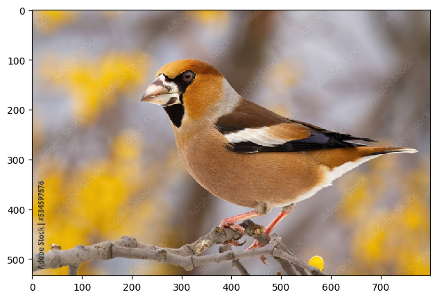 | 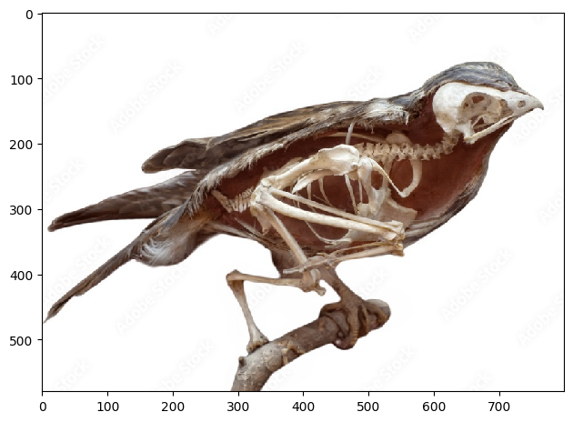 |  |

Even after alignment, because misfitting, the skeleton does not fit well with the bird image, giving just a bad result.

## Laplacian and Gaussian Stacks

A gaussian stack is a series of images that are created by applying a gaussian filter to an image multiple times. This creates a series of images that are blurred at different levels. A laplacian stack is a series of images that are created by subtracting a gaussian filtered image from the original image. This creates a series of images that are the difference between the original image and the blurred image. Basically laplacian stacks hold the high frequency components of the image categorized, while the gaussian stack holds mixed up low frequency components that are used to get the laplacian stack.

The parameters that matter are the standard deviation of the gaussian filter and the number of levels in the stack. The standard deviation determines how much the image is blurred and the number of levels determines how many images are in the stack. We can use the gaussian stack to create a laplacian stack by subtracting the gaussian filtered image from the original image. This creates a series of images that are the difference between the original image and the blurred image. A good approach is to create a laplacian stack at the same time as the gaussian stack, which the reader can find in the code if interested. Essentially, at each level, we first get the gaussian filtered image and then subtract it from the previous level of the gaussian stack to get the laplacian stack at that level. Additionally, we have the last level of the gaussian stack at the highest level of the laplacian stack because we don't have a previous level to subtract from.

### Results of Laplacian Stack 

For the following images: 

| | Apple | Orange | 
| --- | --- | --- |
| Original | 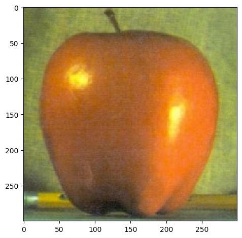 |  |
| level 1 | 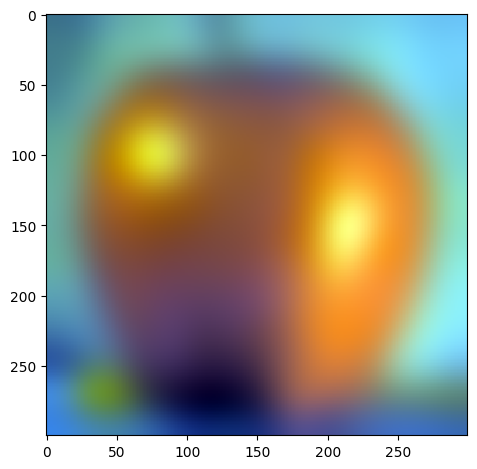 | 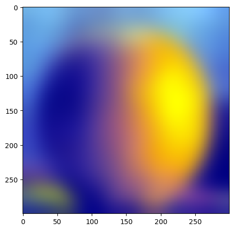 |
| level 2 |  | 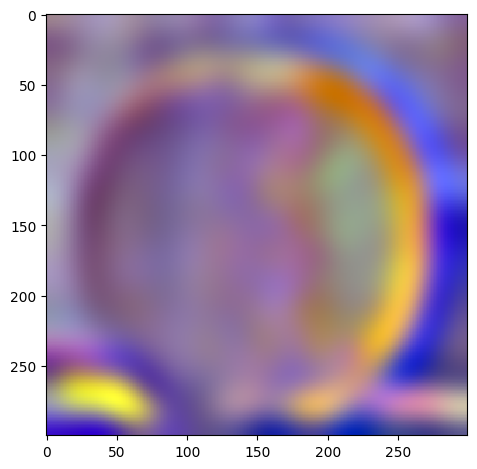 |
| level 3 |  |  |
| level 4 |  |  |
| level 5 |  | 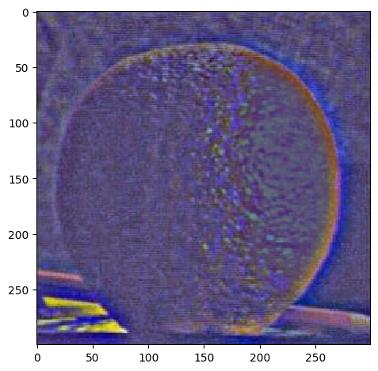 |

*W=45, levels=4 for this and all following results. results above of levels are normalized to be between 0 and 1 for visualization purposes.*

Actually, we can verify that our laplacian stacks are right by collapsing it. We do this by simply adding everything in the laplacian stack together, which will result in the same images. 

| | Apple | Orange |
| --- | --- | --- |
| Original |  |  |
| Collapsed |  | 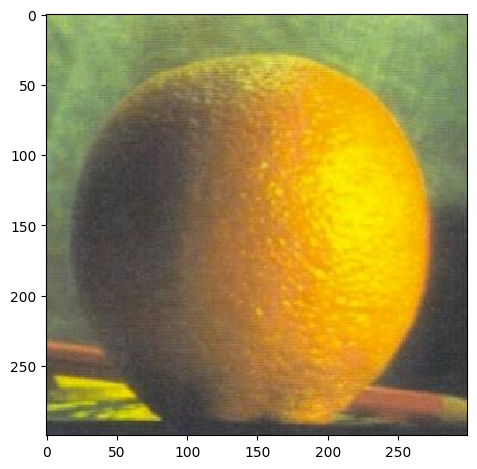 |

## Multi-Resolution Blending

We can use the laplacian stack to blend two images together. We basically use the following formula to blend the images:

$LS_l(i, j) = GR_l(i, j)LA_l(i, j) + (1 - GR_l(i, j))LB_l(i, j)$

where $LS_l$ is the laplacian stack at level $l$, $GR_l$ is the gaussian stack of the **mask** at level $l$, $LA_l$ is the laplacian stack of the first image at level $l$, and $LB_l$ is the laplacian stack of the second image at level $l$. This formula basically blends the two images together at each level of the laplacian stack. We can then collapse the laplacian stack to get the final blended image.

What is the mask and why is it important? The mask is the region of the image that is blended together. Basically it dictates how much of the first image and how much of the second image is blended together. Let's explore how this works. 

### Oraple

If we want to blend the apple and orange images together, we can use a mask that is half black and half white. This means that it will be half of one image and half of the other image per the x axis since the first half is white and the second half is black. It's essentially alpha blending, where the alpha value is 0.5. But we blur it and apply to each level of the laplacian stack so it is smoothlly blended. Here is the mask at some level: 

When we blend the images together, we get the following result: 

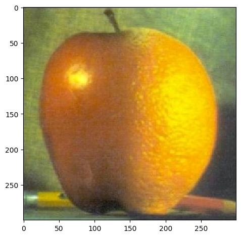

### More Results

Check out an angry dog wearing a venitian mask!

| Image 1 | Image 2 | Mask |
| --- | --- | --- |
| 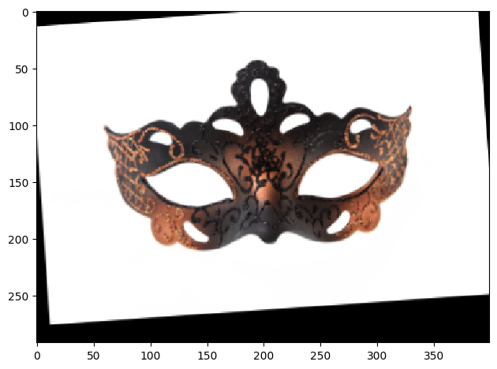 | 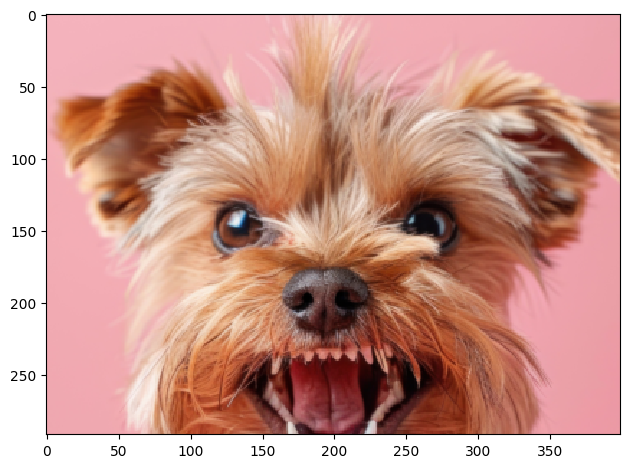 |  

| Blended Image 1 | Blended Image 2 |
| --- | --- |
| 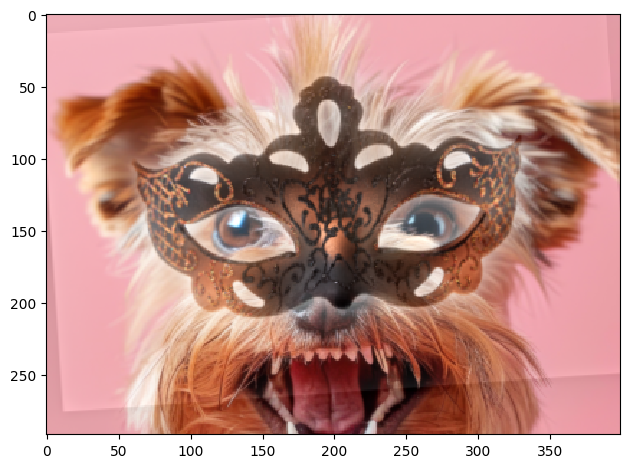 |  |

*The second blend is by making the mask without white background. Mask was created by binarizing white+black and other colors.*

And also Jennifer Lawrence transforming into Mystique!

| Image 1 | Image 2 | Mask |
| --- | --- | --- |
| 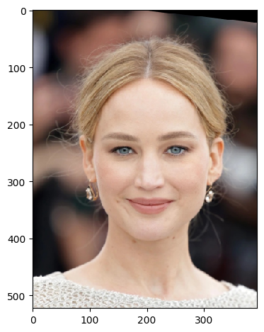 | 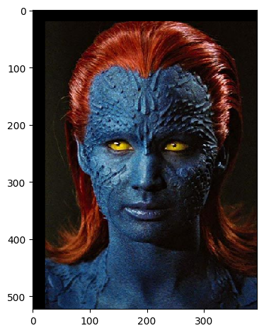 | 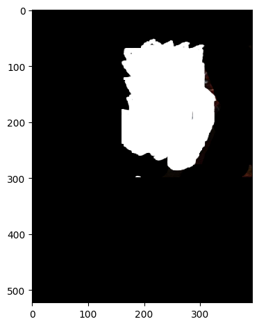 |

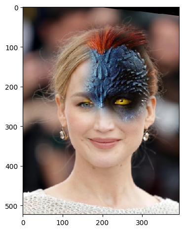 

### Intermediate Results

My favorite result is still the beautiful Oraple! Let's see the intermediate results of the blending process.

| | Apple | Orange | Oraple |
| --- | --- | --- | --- |
| level 1 |  |  |  |
| level 2 |  |  |  |
| level 3 |  |  |  |
| level 4 |  |  |  |
| level 5 |  |  |  |
