# Project 4

# Part A 

# Shoot and digitize pictures

For this project, I took several pictures. When taking these pohotos, I make sure to take them in a well-lit environment, and to take photos from different angles and perspectives. I also made sure to use the exposure to ensure lighting is consistent. Each pair of photos are of the same scene but from different perspectives projections. 

Notice how they all have decent detail in them that dictates straight lines!

<!-- table of 3 images, image on y axis, projection 1 and 2 on x  -->
| | Projection 1 | Projection 2 |
|---|---|---|
| Image Set A: International House Courtyard |  | 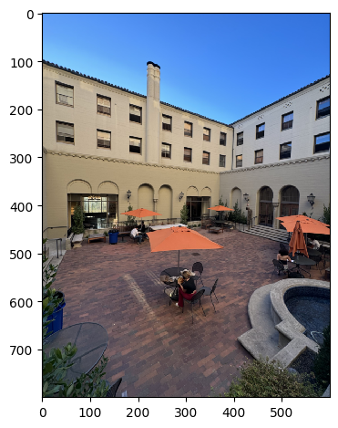 | 
| Image Set B: portrait closet and front door of my dorm |  |  |
| Image Set C: Botanical Garden |  |  |
<!-- | Image Set C: landscape shelf to door of my dorm |  | 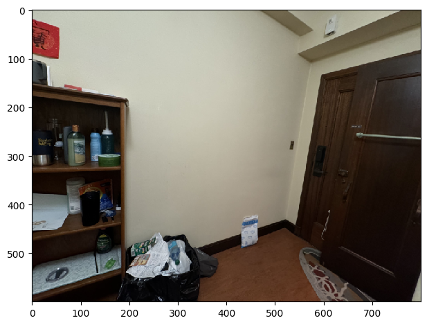 | -->

# Recover Homographies 

For each of the pairs of images, I recovered the transformation between the two images. To do so, I started with correspondences manually. Here are the correspondences I used for Image Set A:

| Image 1 | Image 2 |
|---|---|
|  |  |

It is important for the order of the correspondences to be consistent. I then computed the homography using the following math. What we want is a homography that maps points from the first image to the second image. This consists of a 3x3 matrix H such that $p_2 = H p_1$ where $p_1$ and $p_2$ are points in the first and second image, respectively. To get H, we first get the corresponding points in the two images, then set a matrix equation of the form Ah=b where h is a vector holding the 8 unknown entries of H: 
$$
A = -1 * \begin{bmatrix}
-x_1 & -y_1 & -1 & 0 & 0 & 0 & x_1 x_2 & y_1 x_2 \\
0 & 0 & 0 & -x_1 & -y_1 & -1 & x_1 y_2 & y_1 y_2
\end{bmatrix}
$$

$$
h = \begin{bmatrix}
h_{11} \\ h_{12} \\ h_{13} \\ h_{21} \\ h_{22} \\ h_{23} \\ h_{31} \\ h_{32}
\end{bmatrix}
$$

$$
b = \begin{bmatrix}
x_2 \\ y_2
\end{bmatrix}
$$

We get $A$ from the following mathematical derivation:

$$
\begin{bmatrix}
x_2 \\ y_2
\end{bmatrix} = H \begin{bmatrix}
x_1 \\ y_1 \\ 1
\end{bmatrix} = \begin{bmatrix}
h_{11} & h_{12} & h_{13} \\
h_{21} & h_{22} & h_{23} \\
h_{31} & h_{32} & h_{33}
\end{bmatrix} \begin{bmatrix}
x_1 \\ y_1 \\ 1
\end{bmatrix}
$$

$$
\begin{bmatrix}
x_2 \\ y_2
\end{bmatrix} = \begin{bmatrix}
h_{11} x_1 + h_{12} y_1 + h_{13} \\
h_{21} x_1 + h_{22} y_1 + h_{23} \\
h_{31} x_1 + h_{32} y_1 + h_{33}
\end{bmatrix}
$$

, where $h_{33} = 1$ because we are working in homogeneous coordinates. 

# Warp Images

Deliverable: warped images for each set. 

Once we get the homography, we can apply the homography such that the two images are in the same projection. What I do is apply the homography to Image 1. 

But there's some complexity to it. I first had to create a new image of the new size based on a bounding box I compute (and also allowed as manual input). Then I get the coordinates of the new image and apply the inverse homography to get the coordinates of the original image. I then interpolate the pixel values of the original image to get the pixel values of the new image.

This is what the warped images of Image 1 of each set look like:

| Warped Image 1 of Set A | Warped Image 1 of Set B | Warped Image 1 of Set C |
|---|---|---|
| 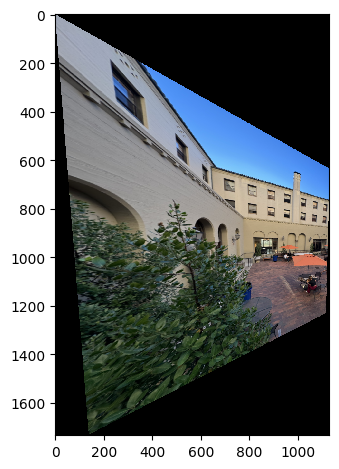 |  | 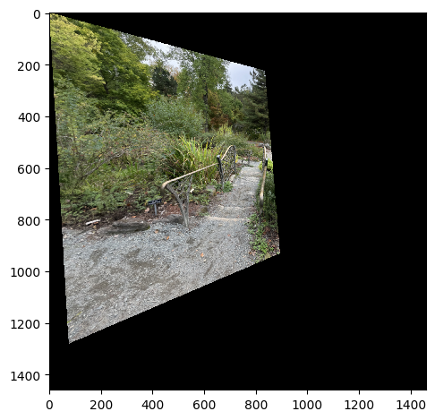 |

# Image Rectification

I also confirmed that the homographies I computed are correct by rectifying images that I know have rectangles. 

Consider the following 2 sets of images: 

Here I take my labtop 

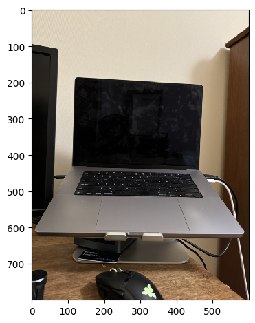

and then apply a trnasform of the TRACKPAD to get the rectangle in following image:

I then get the homography between the two images and warp the images to get the following rectified images:

Look at how the trackpad is now a rectangle! Furthermore, the keyboard is now a rectangle as well and the keys are more clear. Like magic!

Here is another example. 
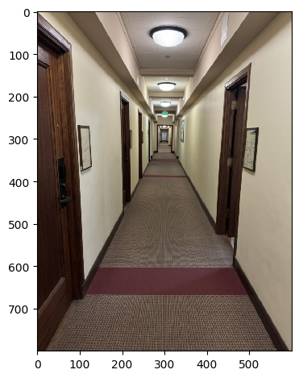

I then apply a transform to get the rectangle in the following image that peeks into the door. You can see the door is now a rectangle:

# Blending Images Into a Mosaic

For each set of images, I apply a mask to the warped images to blend them together. I used Laplacian pyramids of each image to blend them together. 

To start off, I align the images after the warping and then blend them together with techniques in project 3. Here are the results!

| | Image Set A | Image Set B | Image Set C |
|---|---|---|---|
| Mask | |  |  |
| Blended Image |  |  | 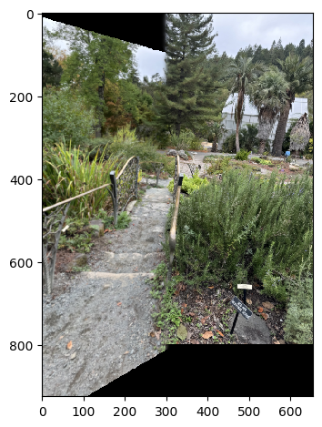 |

<!-- horizontal line break -->
---
---

# Part B

But we can do better! We are doing a lot of things manually. We are manually choosing correspondences and manually choosing the mask. We can automate this process! The first part is to automate the correspondence selection. This process is very involved. The high level overview is we want to detect features in images (which we can do with detecting corners), filter them such that we only keep the best features that spread out well in an image, and then match the features between the two images. Once we have a matching, we can compute the homography, then we can warp the images, and then blend them together. For blending without manual masks, we can use distance transforms. 

# Corner Detection

### No filtering

We first detect corners in the images. We can use the Harris corner detector which we use an in-built function for. Below is an example: 

### With filtering 

If we simply take the Harris corners, there will be too many and it will span the whole image, which is not particularly useful. We want to filter the corners such that we only keep the best corners. We can do this by filtering only harris corners above a certain threshold of the harris response. Below is the harris corners after filtering for the same image: 

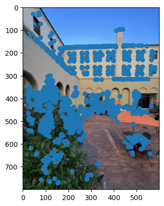

Notice how the corners are more focused on actual corners of the image. If you think about it, it looks like contours of the image are being detected.

# Filter using Adaptive Non-Maximal Suppression (ANMS)

The problem currently is that the corners are too close to each other. We want to spread them out so that we have a good spread of corners. This is important so that we can match the best but distinct corners between the two images. We can do this by using Adaptive Non-Maximal Suppression. The idea is to keep the corners that are the furthest away from each other.

The methodology is as follows. We first give a radius to each point `i` given by: 
$$
r_i = \min_{j}{|x_i - x_j|}, \text{ where } j \text{ is a neighbor of } i \text{ and } f(x_i) < c_{robust} * f(x_j)
$$

In English terms, we find the minimum distance to a neighbor such that the neighbor has a higher score than the current point. We can use different parameters to control the number of corners we want such as by tresholding the radius `r_i` or by setting a maximum number of corners. We can vectorize the processing to get the minimum. Here are ANMS results of Image 1 of set A: 

| filter by 500 interest points | filter by radius 16 | filter by radius 24 | 
|---|---|---|
|  |  | 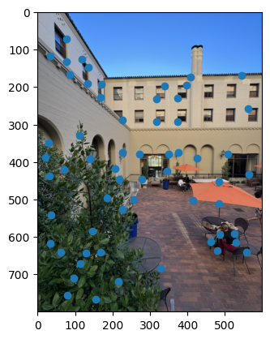 |

We found that filtering by 500 interest points qualitatively gave a better result. Here are the rest of the results using 500 interest points:

| | Image 1 | Image 2 |
|---|---|---|
| Set A |  |  |
| Set B | 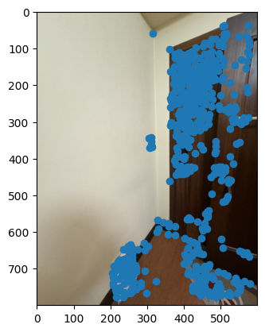 | 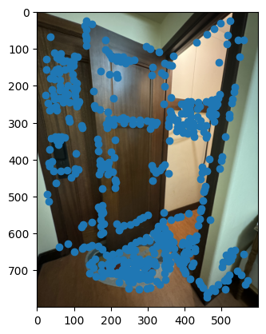 |
| Set C |  |  |

# Feature Descriptor Extraction

Once we have the corners, we need to describe them. We can do this by getting a 40x40 patch around each corner, then Gaussian blurring it to get a 8x8 patch. Now, this patch is a 64-dimensional vector that "roughly" describes the corner. If the same corner is in both images, the descriptor should be similar in terms of Euclidean distance in the 64-dimensional space. We also have to normalize it to be zero mean and unit variance. Here are some exmaples of the descriptors:

| Set A | Set B | Set C |
|---|---|---|
| 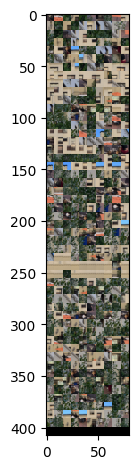 | 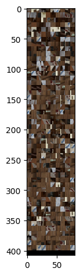 |  |

# Feature Matching

Recall that so far we have filtered the corners, and described them. Now we want to match these good corners between the two images. We can do this by comparing the descriptors of the corners. We can use the Euclidean distance between the descriptors to get the best matches. However, we only want to accept the best matches. We can do this by first having a thought experiment. Consider a corner in the first image, and that it has the lowest Euclidean distance to another corner in the second image. If the second lowest Euclidean distance is close to the lowest Euclidean distance, then we should not accept the match since it means it is so similar that we cannot be sure whether the corner is a great match since it is just as similar to another corner. 

To remove these bad matches, we can use the ratio test between the first and second best match. If the ratio is below a certain threshold, we can accept the match. Finally, we also need to note that matches might not be unique. That is, two or more corners in the first image might match to the same corner in the second image. We can remove these duplicates by simply mapping a one-to-one correspondence between the corners such that the Euclidean distance is minimized. This is a post-processing step. 

After all this, we can get the following matches with a threshold of 0.7:
| | | 
|---|---|
| Set A |  |
| Set B | 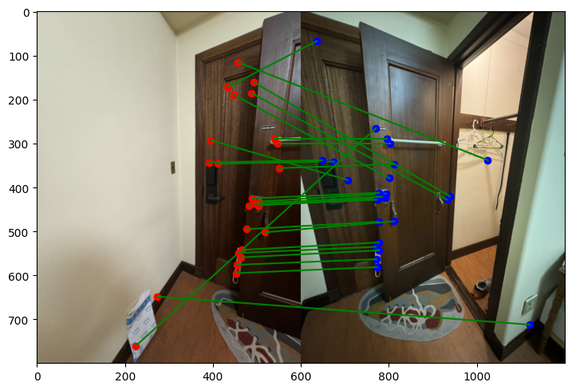 |
| Set C | 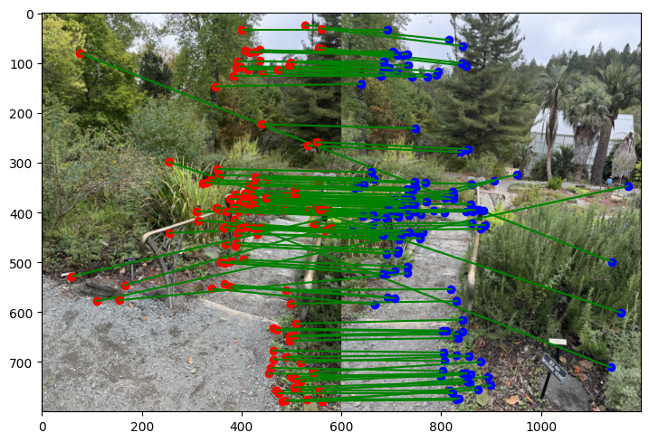 |

The correspondences are pretty good! However, there are some bad matches. We can remove these by using RANSAC.

# RANSAC

Now, we want to get the homography between the two images. We have a bunch of correspondences now, but we really only want the four best ones. Why four? Because we need four points to get a homography. We can use RANSAC to get the best four points. The idea is to randomly select four points in the first image, then get the homography between the two images via the correspondences we found. We can then get the number of inliers by checking how many correspondences are within a certain threshold of the homography. We can repeat this process many times and get the homography with the most inliers. This can all be vectorized. Running 30000 iterations, we get the following best four points: 

| | Image 1 | Image 2 |
|---|---|---|
| Set A |  | 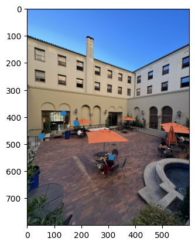 |
| Set B | 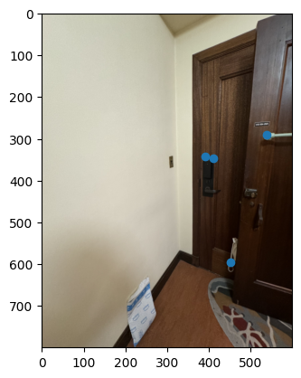 | 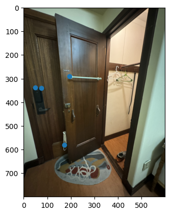 |
| Set C |  |  |

These aren't quite the correspondences I would do manually, but they are certainly correct! 

# A More Robust Blending Approach

We can now blend the images together. To not do this manually, we can use distance transforms. The idea is to get the distance of each pixel to the mask, then use this distance to get an accurate distance. To do this without aligning the images manually, we use the translation from the homographies to get the size of the final image

| Warped Image 1 of Set A | Image 2 of Set B | 
|---|---|
|  | 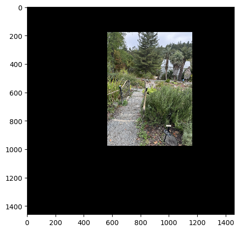 |

Then we get a mask of the images via the distance transform, making the mask white where the distance transform of one image is less than the distance transform of the other image: 

| Distance Transform of Image 1 (Set C) | Distance Transform of Image 2 (Set C) | Resulting Mask |
|---|---|---|
|  |  |  |

Finally, we blend the images together using the mask and Laplacian Blending. Here are the results:

| | Blended Image |
|---|---|
| Set A | 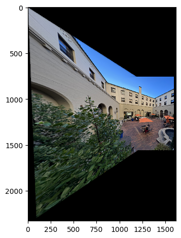 |
| Set B |  |
| Set C | 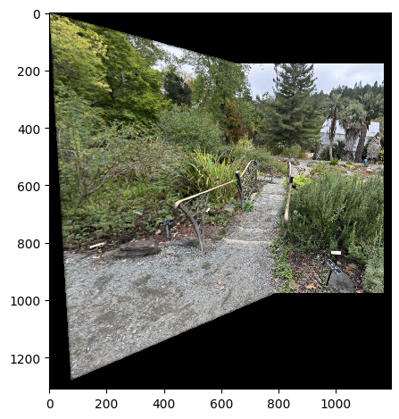 |

To my absolute surprise, these look better than the manual masks! It was funnest to see the results of the blending, and to learn about how to implement the famous RANSAC algorithm and finding correspondences.