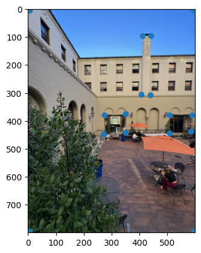
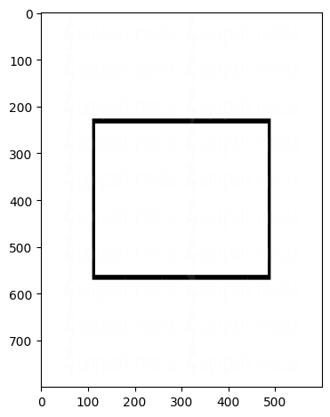
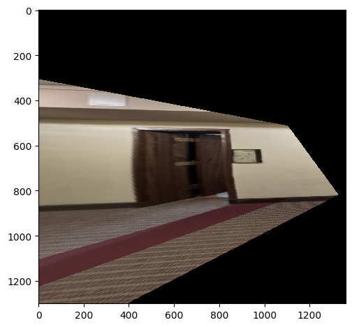
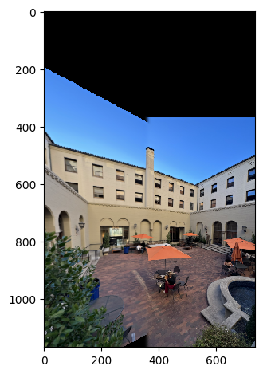
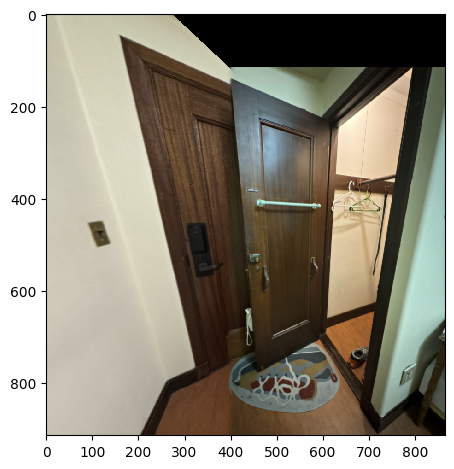
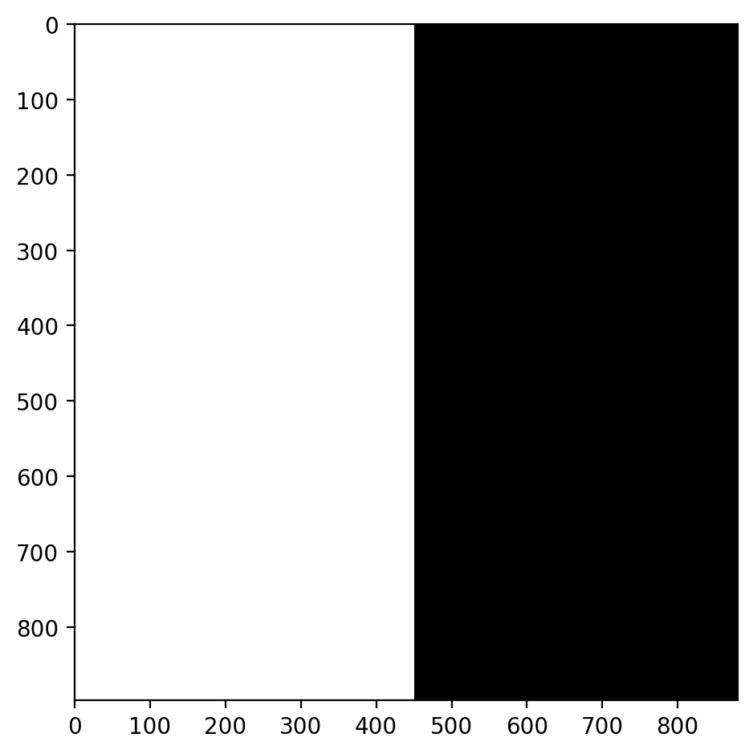
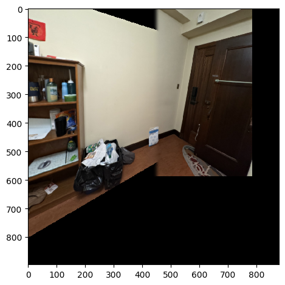

# Project 4A Web Report

# Shoot and digitize pictures

For this project, I took several pictures, mostly of my dormitory. When taking these pohotos, I make sure to take them in a well-lit environment, and to take photos from different angles and perspectives. I also made sure to use the exposure to ensure lighting is consistent. Each pair of photos are of the same scene but from different perspectives projections. 

Notice how they all have decent detail in them that dictates straight lines!

<!-- table of 3 images, image on y axis, projection 1 and 2 on x  -->
| | Projection 1 | Projection 2 |
|---|---|---|
| Image Set A: International House Courtyard |  |  | 
| Image Set B: portrait closet and front door of my dorm |  |  |
| Image Set C: landscape shelf to door of my dorm |  |  |

# Recover Homographies 

For each of the pairs of images, I recovered the transformation between the two images. To do so, I started with correspondences manually. Here are the correspondences I used for Image Set A:

| Image 1 | Image 2 |
|---|---|
|  |  |

It is important for the order of the correspondences to be consistent. I then computed the homography using the following math. What we want is a homography that maps points from the first image to the second image. This consists of a 3x3 matrix H such that $p_2 = H p_1$ where $p_1$ and $p_2$ are points in the first and second image, respectively. To get H, we first get the corresponding points in the two images, then set a matrix equation of the form Ah=b where h is a vector holding the 8 unknown entries of H: 
$$
A = -1 * \begin{bmatrix}
-x_1 & -y_1 & -1 & 0 & 0 & 0 & x_1 x_2 & y_1 x_2 \\
0 & 0 & 0 & -x_1 & -y_1 & -1 & x_1 y_2 & y_1 y_2
\end{bmatrix}
$$

$$
h = \begin{bmatrix}
h_{11} \\ h_{12} \\ h_{13} \\ h_{21} \\ h_{22} \\ h_{23} \\ h_{31} \\ h_{32}
\end{bmatrix}
$$

$$
b = \begin{bmatrix}
x_2 \\ y_2
\end{bmatrix}
$$

We get $A$ from the following mathematical derivation:

$$
\begin{bmatrix}
x_2 \\ y_2
\end{bmatrix} = H \begin{bmatrix}
x_1 \\ y_1 \\ 1
\end{bmatrix} = \begin{bmatrix}
h_{11} & h_{12} & h_{13} \\
h_{21} & h_{22} & h_{23} \\
h_{31} & h_{32} & h_{33}
\end{bmatrix} \begin{bmatrix}
x_1 \\ y_1 \\ 1
\end{bmatrix}
$$

$$
\begin{bmatrix}
x_2 \\ y_2
\end{bmatrix} = \begin{bmatrix}
h_{11} x_1 + h_{12} y_1 + h_{13} \\
h_{21} x_1 + h_{22} y_1 + h_{23} \\
h_{31} x_1 + h_{32} y_1 + h_{33}
\end{bmatrix}
$$

, where $h_{33} = 1$ because we are working in homogeneous coordinates. 

# Warp Images

Deliverable: warped images for each set. 

Once we get the homography, we can apply the homography such that the two images are in the same projection. What I do is apply the homography to Image 1. 

But there's some complexity to it. I first had to create a new image of the new size based on a bounding box I compute (and also allowed as manual input). Then I get the coordinates of the new image and apply the inverse homography to get the coordinates of the original image. I then interpolate the pixel values of the original image to get the pixel values of the new image.

This is what the warped images of Image 1 of each set look like:

| Warped Image 1 of Set A | Warped Image 1 of Set B | Warped Image 1 of Set C |
|---|---|---|
|  |  |  |

# Image Rectification

I also confirmed that the homographies I computed are correct by rectifying images that I know have rectangles. 

Consider the following 2 sets of images: 

Here I take my labtop 

and then apply a trnasform of the TRACKPAD to get the rectangle in following image:

I then get the homography between the two images and warp the images to get the following rectified images:

Look at how the trackpad is now a rectangle! Furthermore, the keyboard is now a rectangle as well and the keys are more clear. Like magic!

Here is another example. 

I then apply a transform to get the rectangle in the following image that peeks into the door. You can see the door is now a rectangle:

# Blending Images Into a Mosaic

For each set of images, I apply a mask to the warped images to blend them together. I used Laplacian pyramids of each image to blend them together. 

To start off, I align the images after the warping and then blend them together with techniques in project 3. Here are the results!

| | Mask | Blended Image |
|---|---|---|
| Image Set A |  |  |
| Image Set B |  |  |
| Image Set C |  |  |