# Project 5 

# Introduction 

This project is about playing with diffusion models, implementing diffusion sampling loops, and exploring the power of diffusion models. In the second part, we go deeper into the architecture of the diffusion model by implementing a unet and ddpm (Denoising Diffusion Probabilistic Models) from scratch. 

# Part A - The Power of Diffusion Models 

In this part, we will use an existing diffusion model, DeepFloyd, to sample images. This will give us an understanding of how diffusion models work and how they can be used to generate images. This is a great way to get a feel for diffusion models before we implement them from scratch in the next part.

## Part 0 - Setup

First, since diffusion takes a while, we need to choose our device. We will use GPUs since they are faster than CPUs. We have tried both using Google Colab and our local machine's metal GPU. Then, we choose the model we want to use -- DeepFloyd. To use it, we load the model, then we take some text embeddings that the model understands and use them to generate images.

We used the seed 276 to generate the images. This seed is used internally by the model to generate the images. Here are some of the images we generated with 2 different inference steps. Notice how the higher the inference step, the more detailed or clear the image becomes:

<!-- table of prompt : inference 10 : inference 20 -->

| prompt | inference 10 | inference 20 |
|--------|--------------|--------------|
| an oil painting of a snowy mountain village |  |  | 
| a man wearing a hat | 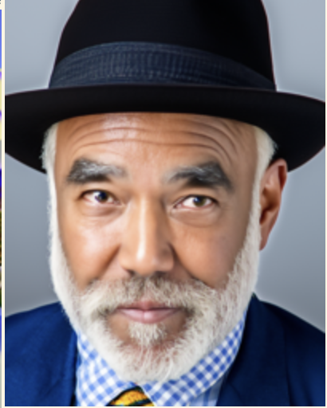 |  | 
| a rocket ship |  |  |

## Part 1 - Sampling Loops

### 1.1 - Implementing the forward process

A key idea of diffusion models is to understand the noising process of an image. This is defined by adding Gaussian noise as such: 

$$ q(x_t | x_0) = N(x_t ; \sqrt{\bar\alpha_t} x_0, (1 - \bar\alpha_t)\mathbf{I})\tag{1}$$

which is equivalent to: $$ x_t = \sqrt{\bar\alpha_t} x_0 + \sqrt{1 - \bar\alpha_t} \epsilon \quad \text{where}~ \epsilon \sim N(0, 1) \tag{2}$$

To see this in action, we implement the forward process of the diffusion model. We start with a clean image and add noise to it. Here are some results given a certain timestep `t` for the Campenilli tower:

| t | 0 | 250 | 500 | 750 |
|---|---|-----|-----|-----|
| image | 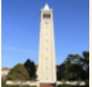 |  |  | 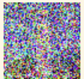 |

### 1.2 Classical Denoising

The reason why this is important is that diffusion models make use of this noising process to denoise images into AI-generated images. But first, let's see how we can denoise images using classical methods. One can use a simple Gaussian filter to denoise images, though we will get pretty subpar results. Here are some results of denoising the Campenilli tower image using a Gaussian filter: 

| t | 250 | 500 | 750 |
| --- | --- | --- | --- |
| kernel size | 3 | 5 | 9 |
| noisy image |  |  |  |  |
| classically denoised image | 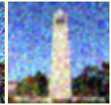 |  |  |

### 1.3 - Implementing One Step Denoising 

Now that we have seen how classical denoising works, we can compare it to the denoising process of the diffusion model. Think of it like an AI predicting the denoised image. How we can do this is to first apply noise to the original image at a timestep `t`, then use the model to predict the denoised image given `t`. Here are some results of the denoising process of the Campenilli tower image:

| t | 250 | 500 | 750 |
| --- | --- | --- | --- |
| noisy image |  |  |  |  |
| denoised image |  | 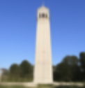 | 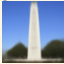 |

We can see that the denoised images are much better than the classically denoised images. Except, we see that the more `t` increases, the less accurate the denoised image becomes. One amazing thing is that we already generated fake images that "look" like the Campenilli tower. This is the power of diffusion models.

### 1.4 - Implementing Iterative Denoising

So actually, the true denoising process done in practice is to iteratively denoise the image. This is how we can improve the denoised image. To do this, we take a loop over a step in `t` and denoise the image iteratively. To iteratively, denoise, we have the following formula:

$$ 
x_{t'} = \frac{\sqrt{\bar\alpha_{t'}}\beta_t}{1 - \bar\alpha_t} x_0 + \frac{\sqrt{\alpha_t}(1 - \bar\alpha_{t'})}{1 - \bar\alpha_t} x_t + v_\sigma
$$

<!-- \tag{3}$ -->

where:
- $x_t$ is your image at timestep $t$
- $x_{t'}$ is your noisy image at timestep $t'$ where $t' < t$ (less noisy)
- $\bar\alpha_t$ is defined by `alphas_cumprod`, as explained above.
- $\alpha_t = \bar\alpha_t / \bar\alpha_{t'}$
- $\beta_t = 1 - \alpha_t$
- $x_0$ is our current estimate of the clean image using equation 2 just like in section 1.3

The $v_\sigma$ is random noise, which in the case of DeepFloyd is also predicted. The process to compute this is not very important for us, so we supply a function, `add_variance`, to do this for you. 

Doing a strided timestep of 30 at each step, starting from timestep 990 all the way to zero, and then starting on the 10th in this strided tiemstep, we can get the results shown below: 

| iteration | 10 | 15 | 20 | 25 | 30 | 
| --- | --- | --- | --- | --- | --- |
| denoised image |  |  | 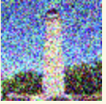 | 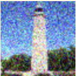 |  |

And we can compare this with our one step denoising and our classical denoising:

| Original | ITerative Denoising | One Step Denoising | Classical Denoising |
| --- | --- | --- | --- |
|  | 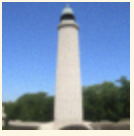 | 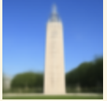 |  |

We can see that the iterative denoising process is much better than the one-step denoising process and the classical denoising process. 

### 1.5 - Diffusion Model Sampling

Aside from denoising an image to get the Campenilli, we can also just start with random noise, and the model will automatically try to get an image on the manifold of real images! Here are some results of sampling images from random noise. Unfortunately, they are not great, but it is still interesting to see how the model tries to generate images from random noise:

| Sample 1 | Sample 2 | Sample 3 | Sample 4 | Sample 5 |
| --- | --- | --- | --- | --- |
| 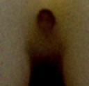 |  |  | 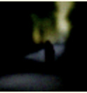 |  |

### 1.6 - Classifier-Free Guidance 

To improve the quality of the generated images, we can use a classifier-free guidance. Basically, we can give a text prompt to the model to guide it in generating images, kind of like with Dall-E. To make our images better, we can condition in on the prompt "a high quality photo". This gives us better results at the expense of diversity. 

To implement this, we have to not only predict the noise from the model with no condition, but also predict the noise from the model with the condition. We then take the difference between the two to get the noise that we want to add to the image with some guidance scale. In CFG, we compute both a noise estimate conditioned on a text prompt, and an unconditional noise estimate. We denote these $\epsilon_c$ and $\epsilon_u$. Then, we let our new noise estimate be

$$\epsilon = \epsilon_u + \gamma (\epsilon_c - \epsilon_u) \tag{4}$$

where $\gamma$ controls the strength of CFG. Notice that for $\gamma=0$, we get an unconditional noise estimate, and for $\gamma=1$ we get the conditional noise estimate. The magic happens when $\gamma > 1$. With the guidance scale of `7`, we can get the following results:

| Sample 1 | Sample 2 | Sample 3 | Sample 4 | Sample 5 |
| --- | --- | --- | --- | --- |
|  |  | 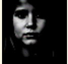 |  |  |

We can see that the images are qualitatively better than the ones generated without the guidance scale.

### 1.7 - Image to Image Translation

So we've seen two things so far: Getting an image similar to the Campenilli tower but not quite, and generating random realistic images from noise. But what if we want a similar image to the Campenilli tower, but also completely different? One thing we can actually do is to take an image and translate it to another image. This is called image to image translation. We can take the initial image, noise it a little, then denoise it to get a new image. Essentially, we are asking the model to get an image "similar" to the Campenilli tower but not quite. The more we noise the image, the more different the image will be from the original. Here are some results of image to image translation for different noise levels (defined by `i_start`, the timestep to start denoising where the lower the `i_start`, the more noise is added):

| Original | i_start = 1 | i_start = 3 | i_start = 5 | i_start = 7 | i_start = 10 | i_start = 20 |
| --- | --- | --- | --- | --- | --- | --- |
|  |  |  |  |  |  | 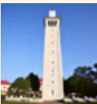 | 
|  |  |  | 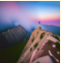 | 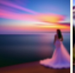 |  |  |
|  |  |  |  |  |  |  |

### 1.7.1 - Editing Hand Drawn and Web Images 

We can also use the model to edit hand-drawn images and web images with the same process. Here are some results of editing hand-drawn and web images:

| Original | i_start = 1 | i_start = 3 | i_start = 5 | i_start = 7 | i_start = 10 | i_start = 20 |
| --- | --- | --- | --- | --- | --- | --- |
|  |  |  |  | 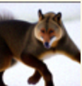 |  | 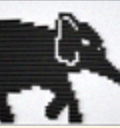 |
| 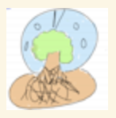 |  |  |  |  |  |  |
| 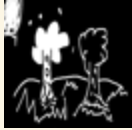 | 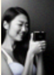 |  |  |  | 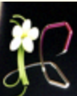 |  |

NOTE: The first is web image came from https://i.pinimg.com/originals/22/9c/56/229c56342f2303522a3189376909dfb5.jpg. 

More Results (looking like an actual tree!):

| Image 2 with i_start = 22 | 
| --- |
|  |

### 1.7.2 - Inpainting 

We can essentially run the same procedure on an image with a mask to inpaint the image. To do this, we can run the denoising loop with doing the following every loop: 

$$ x_t \leftarrow \textbf{m} * x_t + (1 - \textbf{m}) \text{forward}(x_{orig}, t)$$

Essentially, we leave everything inside the edit mask alone, but we replace everything outside the edit mask with our original image -- with the correct amount of noise added for timestep $t$.

Here are some results of inpainting:

| Original | Mask | To Replace | Inpainted |
| --- | --- | --- | --- |
| 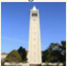 |  |  | 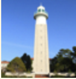 |
|  | 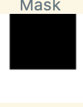 |  |  |
| 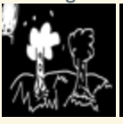 | 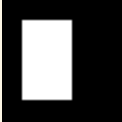 | 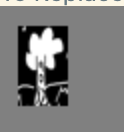 | 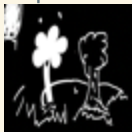 |

### 1.7.3 - Text-Conditioned Image to Image Translation

Now, we will try to do condition our image to image translation. So far we have made it a "high quality photo", but what if we want to condition it on a text prompt? 

Here is an example of our same images being conditioned on the prompt "a rocket ship":

| i_start = 1 | i_start = 3 | i_start = 5 | i_start = 7 | i_start = 10 | i_start = 20 |
| --- | --- | --- | --- | --- | --- |
|  |  |  |  |  | 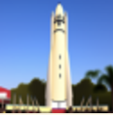 |
|  |  |  |  |  |  |
|  |  |  |  |  |  |

These are completely differently themed rockets! But actually we can use pretty much any prompt that the model understands. For example, taing image 2 with the prompt "an oil painting of people around a campfire", we get the following result: 

It's pretty cool to see my drawings transform into something else. 

### 1.8 - Visual Anagrams 

But we can do more than that! We can also do visual anagrams. We can take an image that when flipped, looks like another image. The algorithm is as follows: 

$ \epsilon_1 = \text{UNet}(x_t, t, p_1) $

$ \epsilon_2 = \text{flip}(\text{UNet}(\text{flip}(x_t), t, p_2))$

$ \epsilon = (\epsilon_1 + \epsilon_2) / 2 $

Essentially, we remove noise to make the image look like prompt 1, than add noise to make the flipped image look like prompt 2. Then we average the noise to get the final noise. Here are some results of visual anagrams: 

| Prompt 1 | Prompt 2 | Visual Anagram | Visual Anagram Flipped |
| --- | --- | --- | --- |
| an oil painting of an old man | an oil painting of people around a campfire |  |  |
| a lithograph of a skull | a photo of a man |  |  |
| a photo of a dog | a pencil | 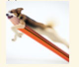 | 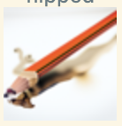 |

You can really see it. It's pretty cool! 

### 1.10 - Hybrid Images 

We can also do hybrid images. We can take two images and combine them to get a hybrid image. A hybrid image is an image that looks like one image from far away, but another image up close.

The algorithm is as follows:

$ \epsilon_1 = \text{UNet}(x_t, t, p_1) $

$ \epsilon_2 = \text{UNet}(x_t, t, p_2) $

$ \epsilon = f_\text{lowpass}(\epsilon_1) + f_\text{highpass}(\epsilon_2)$

where UNet is the diffusion model UNet, $f_\text{lowpass}$ is a low pass function, $f_\text{highpass}$ is a high pass function, and $p_1$ and $p_2$ are two different text prompt embeddings. Our final noise estimate is $\epsilon$. Here are some results of hybrid images:

| Prompt 1 | Prompt 2 | Hybrid Image |
| --- | --- | --- |
| a lithograph of waterfalls | a lithograph of a skull |  |
| a rocket ship | a pencil |  |
| a photo of a man | a photo of a dog |  |

# Part B - Training Your own Diffusion Model!

## Part 1: Training a Single-Step Denoising UNet

### 1.1 Implementing the UNet

A denoising diffusion model is essentially a UNet. We can implement a UNet from scratch. The UNet is a neural network that takes an image and predicts the noise to add to the image to denoise it. The UNet is defined as follows:

We can train it on the mnist dataset so that it predicts the noise to add to the image to denoise it. Essentially, we recreate the noise process for the mnist dataset (sigma being how noisy it is): 

### 1.2 Training a Denoiser 

Then we can use a MSE loss to train the UNet. Our hyperparameters are as follows: 
- batch size: 256. 
- epochs: 5
- hidden dimension: 128
- optimizer: Adam with learning rate of 1e-4

We get the following loss curve when training on images of sigma = 0.5:

Here are some results of training the UNet on the mnist dataset:

| Epoch = 1 | Epoch = 5 | 
| --- | --- |
| 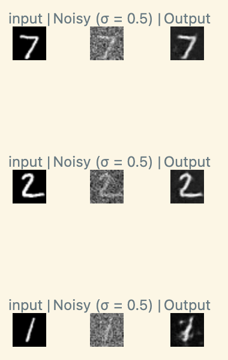 | 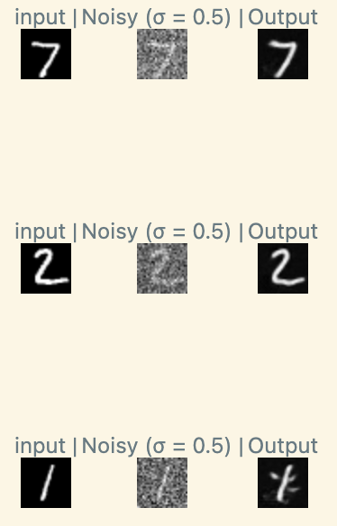 |

We can notice better denoising as the epochs increase.

### 1.2.2 - Out of Distribution Testing

We can also test the UNet on out of distribution data outside of sigma = 0.5. Results are below, but notice how it does well for some sigmas but begins to fail for sigma outside of 0.5:

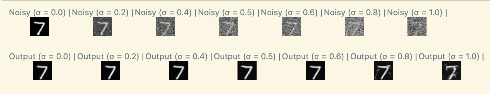

## Part 2: Training a Denoising Diffusion Probabilistic Model (DDPM)

Instead of just predicting the clean image, we can also predict the noise given the timestep of how noisy the image is. This is called a Denoising Diffusion Probabilistic Model (DDPM). Essentially we can therefore make AI generated number images. We can implement this from scratch. The DDPM is defined as follows:

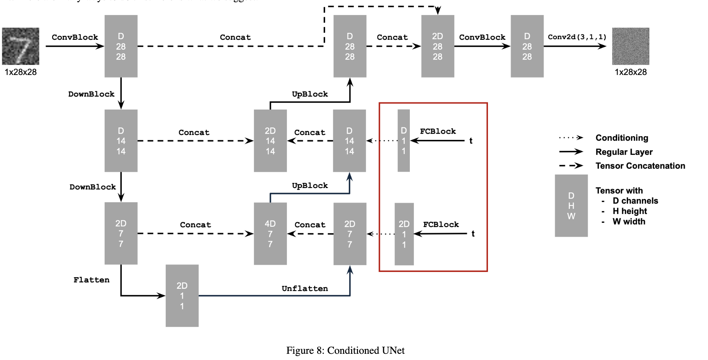

with the following hyperparameters:
- batch size: 128
- epochs: 20
- hidden dimension: 64
- optimizer: Adam with learning rate of 1e-3
- learning rate scheduler: ExponentialLR with gamma of 0.1^(1/epochs)

We get the following loss curve when training on the mnist dataset:

| log scale | linear scale |
| --- | --- |
| 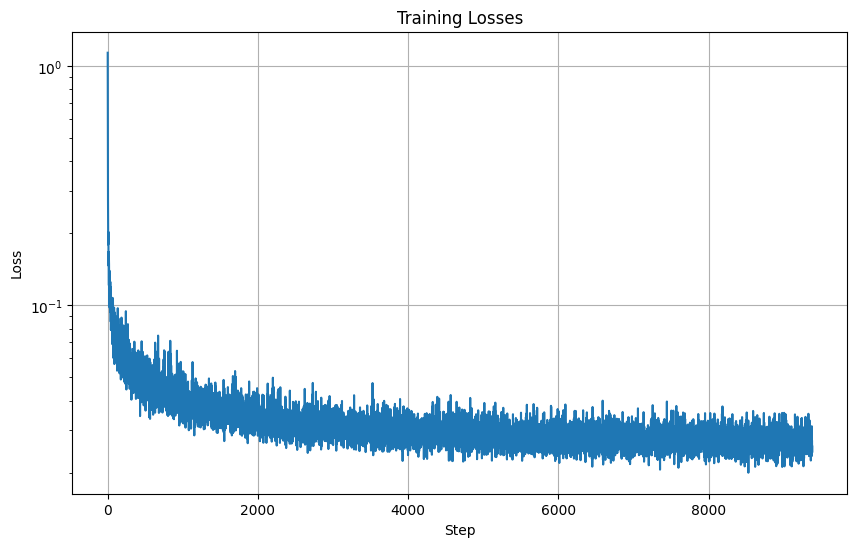 |  |

Here are some results of training the DDPM on the mnist dataset:

| Epoch = 5 | Epoch = 20 | 
| --- | --- |
| 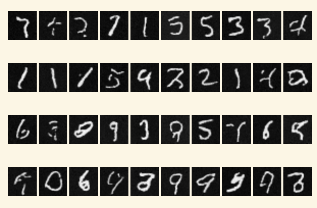 | 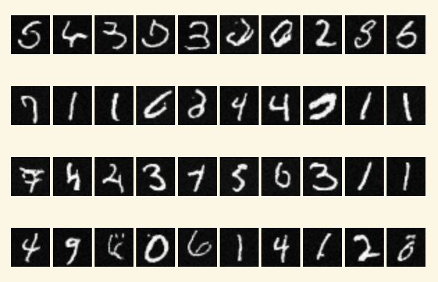 |

It's reasonable after 20 epochs. A problem is that we can't sample specific numbers. Let's fix that. 

### 2.3: Training a Conditional DDPM

We can condition the DDPM on the number we want to generate. With that small tweak and the same hyperparameters as before, we can get the following loss curve when training on the mnist dataset. We apply classifier free guidance with a guidance scale of 5: 

| log scale | linear scale |
| --- | --- |
|  |  |

Here are some results of training the Conditional DDPM on the mnist dataset:

| Epoch = 5 | Epoch = 20 |
| --- | --- |
| 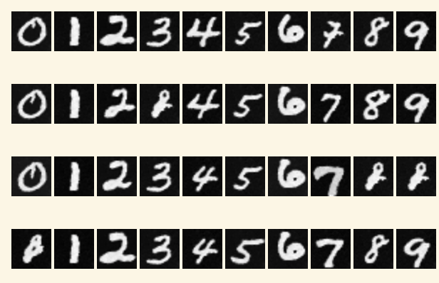 | 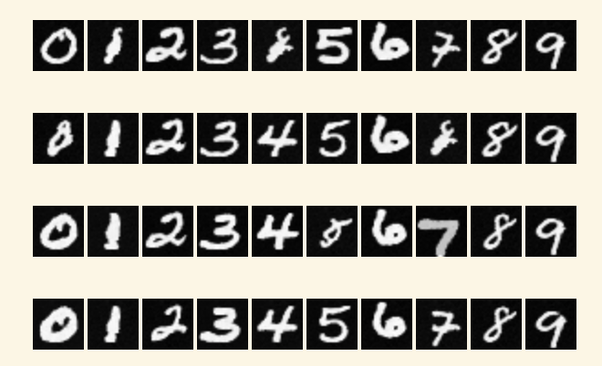 |
